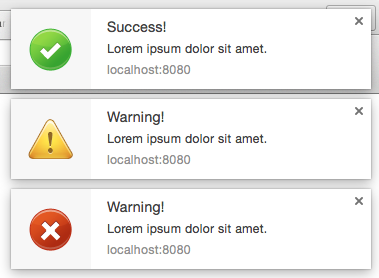

## Screamer.JS
[](https://travis-ci.org/willianjusten/screamer-js)


> Screamer.js is a Vanilla Javascript plugin to provide simple yet fully customisable web notifications using [Web Notifications API](http://www.w3.org/TR/notifications/).

## Demo



If you want to see how it works, take a look at the [DEMO](http://willianjusten.com.br/screamer-js/example/).

## Installation

1. Download the [zip](https://github.com/willianjusten/screamer-js/archive/master.zip)
2. Paste the [screamer.js](https://github.com/willianjusten/screamer-js/blob/master/screamer.js) at your `js` assets folder.
3. If you want to use same images, get them on [https://github.com/willianjusten/screamer-js/tree/master/example] and paste to your `img` assets folder.

## How to Use

To create the Notification you have to create a new instance of `Screamer`, set some options that you wish and use the `notify` method to start the notification. Take a look at this snippet:

```js

// create an instance of Screamer with some options
var scream = new Screamer({
    'title': 'Success!',
    'body': 'Lorem ipsum dolor sit amet.',
    'icon': 'icon_success.png',
    'fade': 1000
});

// adding an eventListener to call the Notification
var button = document.querySelector('#fade');
button.addEventListener('click', function(){
    scream.notify();
});
```

You can attach this to different events, like `onload`, `ready` or anything else that allows to call the `notify` method.

## Options

- `title` (string) - notification title. (**REQUIRED**)
- `body` (string) - notification message.
- `icon` (string) - path to the notification icon.
- `tag` (string) - unique identifier to stop duplicate notifications.
- `lang` (string) - language of the notification. (default: en).
- `timeout` (integer) - time in miliseconds to fade the notification.

## Static Methods

- `Screamer.verifySupport()` - Function to test for Web Notifications API browser support.
- `Screamer.checkPermission()` - Verify if permission exists, if not, request a permission and verify if granted.

## Testing

First of all, install the [NodeJS](https://nodejs.org/) and deppendencies.

```sh
npm install
```

Later, you can run all tests running:

```sh
npm test
```

This should be open a Firefox instance and do a single run of tests.

## Run Demo locally

Because the Web Notification require some permissions, you have to run this on a single server. An easy way to run this is:

```sh
python -m SimpleHTTPServer
```

*Pay attention if your port is not in use.* 

## Browser Support

This library relies on [Web Notifications API](http://www.w3.org/TR/notifications/). And this API is supported in the following browsers.

 |  |  |  | 
--- | --- | --- | --- | --- |
Nope ✘ | 31+ ✔ | 38+ ✔ | 32+ ✔ | 8+ ✔ |

## License 

This plugin is free and open source software, distributed under the The MIT License. So feel free to use this to create notifications for your site without linking back to me or using a disclaimer.

If you’d like to give me credit somewhere on your blog or tweet a shout out to @willian_justen, that would be pretty sweet.
